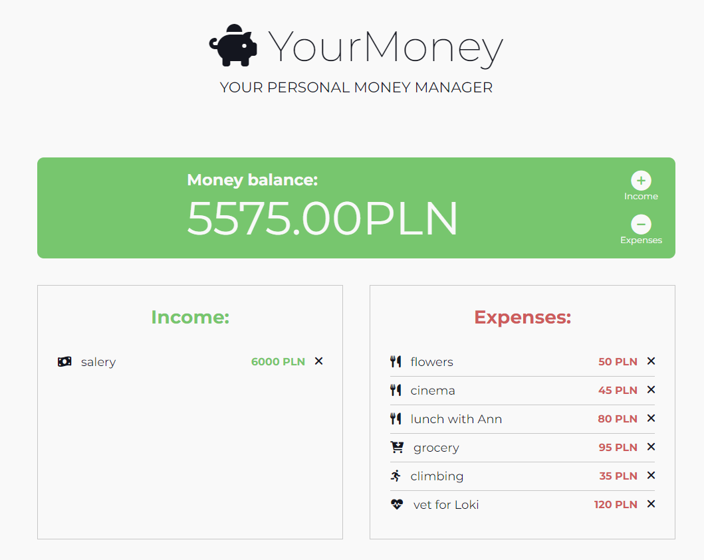

# 📝 DESCRIPTION

YourMoney is a simple application designed to help you manage your money, so you stay in control and achieve your future
investment goals. YourMoney will help you to control your finances, analyze expenses and finally limit e.g. unnecessary
purchases.  
Get and keep full control of your finances.

# 📓 TECHNOLOGIES
* JavaScript (Vanilla JS)
* GitFlow
* HTML5
* CSS3
* Fontawesome

# 👌 FEATURES
* You can add and manage your expenses
* You can remove unwanted item
* You can select different categories for your expenses
* Money balance will update after each transaction

# ▶️ DEMO
https://kingakw.github.io/yourmoney/

# 🆔 LICENSE
MIT License

